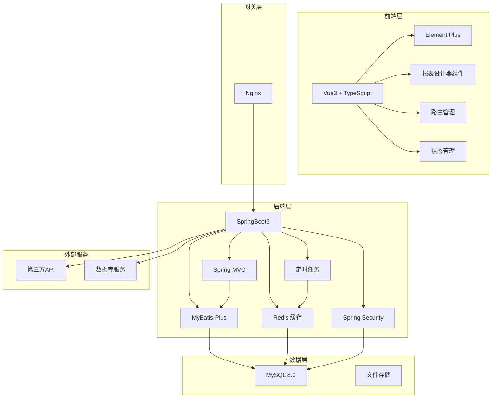
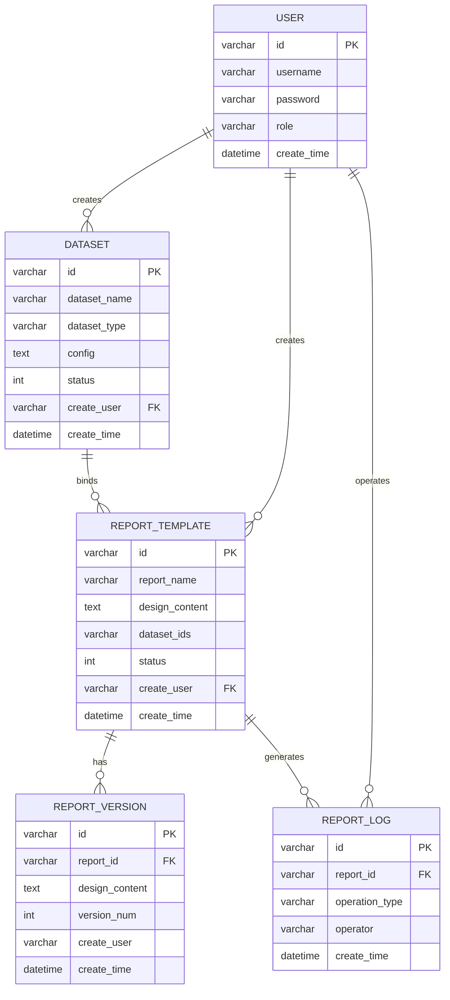

# 在线报表设计系统详细设计方案

## 一、文档概述

### 1.1 文档目的
本文档详细描述基于 SpringBoot3 + Vue3 的在线报表设计系统的技术架构、模块设计、数据库设计、接口设计等，为系统开发提供详细的技术指导。

### 1.2 文档范围
- 系统总体技术架构
- 前端技术选型与架构设计
- 后端技术选型与架构设计
- 数据库设计
- 核心模块详细设计
- 接口设计规范

## 二、系统总体架构

### 2.1 技术架构图



### 2.2 分层架构
1. **表现层**：Vue3 前端应用，负责用户界面交互
2. **控制层**：Spring MVC，处理 HTTP 请求
3. **业务层**：核心业务逻辑处理
4. **持久层**：MyBatis-Plus，数据访问
5. **数据层**：MySQL 数据库 + 文件存储

## 三、前端架构设计

### 3.1 技术选型
- **框架**：Vue 3.x + TypeScript
- **构建工具**：Vite
- **UI 组件库**：Element Plus
- **状态管理**：Pinia
- **路由管理**：Vue Router 4.x
- **HTTP 客户端**：Axios
- **报表设计器**：基于 Handsontable 或自研的类 Excel 表格组件

### 3.2 项目结构
```
frontend/
├── public/                 # 静态资源
├── src/
│   ├── api/               # API 接口
│   ├── assets/            # 资源文件
│   ├── components/        # 公共组件
│   │   ├── ReportDesigner/ # 报表设计器组件
│   │   └── ...
│   ├── layouts/           # 布局组件
│   ├── router/            # 路由配置
│   ├── stores/            # Pinia 状态管理
│   ├── utils/             # 工具函数
│   ├── views/             # 页面组件
│   │   ├── Dataset/       # 数据集管理
│   │   ├── Report/        # 报表管理
│   │   ├── System/        # 系统管理
│   │   └── ...
│   ├── App.vue
│   └── main.ts
├── package.json
└── vite.config.ts
```

### 3.3 核心模块详细设计

#### 3.3.1 报表设计器组件
**功能描述**：提供类 Excel 的在线编辑界面
**核心子组件**：
- 表格编辑区：单元格编辑、合并、样式设置
- 工具栏：字体、边框、对齐等操作按钮
- 数据集面板：右侧展示可用数据集和字段
- 属性面板：配置单元格/数据集属性
- 预览组件：实时预览报表效果

**数据结构**：
```typescript
interface ReportDesign {
  cells: Cell[];
  rows: number;
  cols: number;
  mergedCells: MergedCell[];
  datasetBindings: DatasetBinding[];
  styles: StyleConfig;
}

interface Cell {
  row: number;
  col: number;
  value: string;
  style: CellStyle;
}

interface DatasetBinding {
  cellKey: string;
  datasetId: string;
  fieldName: string;
  bindingType: 'single' | 'column';
}
```

#### 3.3.2 数据集管理模块
**页面**：
- 数据集列表页
- 数据集创建/编辑页（分 SQL/API/文件三种类型）
- 数据集测试页

**核心功能**：
- 数据集 CRUD
- 连通性测试
- 字段解析
- 权限管理

## 四、后端架构设计

### 4.1 技术选型
- **框架**：Spring Boot 3.x
- **ORM**：MyBatis-Plus
- **数据库**：MySQL 8.0
- **缓存**：Redis
- **安全**：Spring Security + JWT
- **定时任务**：Spring Task
- **文件处理**：EasyExcel、Apache POI
- **工具库**：Hutool、Jackson

### 4.2 项目结构
```
backend/
├── src/main/java/com/report/
│   ├── ReportApplication.java
│   ├── controller/         # 控制层
│   │   ├── DatasetController.java
│   │   ├── ReportController.java
│   │   ├── UserController.java
│   │   └── SystemController.java
│   ├── service/            # 业务层
│   │   ├── DatasetService.java
│   │   ├── ReportService.java
│   │   ├── UserService.java
│   │   └── impl/
│   ├── mapper/             # 持久层
│   │   ├── DatasetMapper.java
│   │   ├── ReportMapper.java
│   │   └── ...
│   ├── entity/             # 实体类
│   │   ├── Dataset.java
│   │   ├── ReportTemplate.java
│   │   └── ...
│   ├── dto/                # 数据传输对象
│   ├── vo/                 # 视图对象
│   ├── config/             # 配置类
│   ├── security/           # 安全相关
│   ├── task/               # 定时任务
│   └── utils/              # 工具类
└── src/main/resources/
    ├── application.yml
    └── mapper/
```

### 4.3 核心模块详细设计

#### 4.3.1 数据集模块
**功能**：
- SQL 数据集：连接数据库、执行查询、解析结果
- API 数据集：发送 HTTP 请求、解析 JSON
- 文件数据集：解析 Excel/CSV 文件

**核心类设计**：
```java
// 数据集抽象类
public abstract class DatasetHandler {
    public abstract DatasetTestResult test(Dataset dataset);
    public abstract List<Map<String, Object>> fetchData(Dataset dataset, Map<String, Object> params);
    public abstract List<FieldInfo> parseFields(Dataset dataset);
}

// SQL 数据集处理器
public class SqlDatasetHandler extends DatasetHandler {
    // 实现 SQL 执行逻辑
}

// API 数据集处理器
public class ApiDatasetHandler extends DatasetHandler {
    // 实现 API 调用逻辑
}

// 文件数据集处理器
public class FileDatasetHandler extends DatasetHandler {
    // 实现文件解析逻辑
}
```

#### 4.3.2 报表渲染模块
**功能**：
- 根据绑定关系获取数据
- 渲染报表数据
- 支持分页、排序、过滤

**核心流程**：
1. 接收报表模板 ID 和渲染参数
2. 解析模板中的数据集绑定关系
3. 调用相应数据集处理器获取数据
4. 应用过滤、排序、分页
5. 返回渲染结果

## 五、数据库设计

### 5.1 ER 图



### 5.2 数据表设计

#### 5.2.1 用户表（sys_user）
| 字段名 | 类型 | 长度 | 允许空 | 说明 |
|--------|------|------|--------|------|
| id | varchar | 32 | 否 | 主键 |
| username | varchar | 50 | 否 | 用户名 |
| password | varchar | 100 | 否 | 密码（加密） |
| real_name | varchar | 50 | 是 | 真实姓名 |
| role | varchar | 20 | 否 | 角色：ADMIN/DESIGNER/USER |
| email | varchar | 100 | 是 | 邮箱 |
| status | int | 1 | 否 | 状态：0禁用 1启用 |
| create_time | datetime | - | 否 | 创建时间 |
| update_time | datetime | - | 是 | 更新时间 |

#### 5.2.2 数据集表（dataset）
| 字段名 | 类型 | 长度 | 允许空 | 说明 |
|--------|------|------|--------|------|
| id | varchar | 32 | 否 | 主键 |
| dataset_name | varchar | 100 | 否 | 数据集名称 |
| dataset_type | varchar | 20 | 否 | 类型：SQL/API/FILE |
| config | text | - | 是 | 配置信息 JSON |
| status | int | 1 | 否 | 状态：0草稿 1可用 2禁用 |
| create_user | varchar | 32 | 否 | 创建人 ID |
| create_time | datetime | - | 否 | 创建时间 |
| update_time | datetime | - | 是 | 更新时间 |

#### 5.2.3 报表模板表（report_template）
| 字段名 | 类型 | 长度 | 允许空 | 说明 |
|--------|------|------|--------|------|
| id | varchar | 32 | 否 | 主键 |
| report_name | varchar | 100 | 否 | 报表名称 |
| design_content | text | - | 否 | 设计器内容 JSON |
| dataset_ids | varchar | 500 | 是 | 绑定数据集 ID，逗号分隔 |
| category | varchar | 50 | 是 | 分类 |
| status | int | 1 | 否 | 状态：0草稿 1已发布 |
| is_public | int | 1 | 否 | 是否公开：0私有 1公开 |
| create_user | varchar | 32 | 否 | 创建人 ID |
| create_time | datetime | - | 否 | 创建时间 |
| update_time | datetime | - | 是 | 更新时间 |

#### 5.2.4 报表版本表（report_version）
| 字段名 | 类型 | 长度 | 允许空 | 说明 |
|--------|------|------|--------|------|
| id | varchar | 32 | 否 | 主键 |
| report_id | varchar | 32 | 否 | 报表 ID |
| design_content | text | - | 否 | 设计器内容 JSON |
| version_num | int | 11 | 否 | 版本号 |
| create_user | varchar | 32 | 否 | 创建人 |
| create_time | datetime | - | 否 | 创建时间 |

#### 5.2.5 操作日志表（operation_log）
| 字段名 | 类型 | 长度 | 允许空 | 说明 |
|--------|------|------|--------|------|
| id | varchar | 32 | 否 | 主键 |
| module | varchar | 50 | 否 | 模块 |
| operation | varchar | 50 | 否 | 操作类型 |
| method | varchar | 200 | 是 | 请求方法 |
| params | text | - | 是 | 请求参数 |
| result | text | - | 是 | 执行结果 |
| operator | varchar | 50 | 否 | 操作人 |
| ip | varchar | 50 | 是 | IP 地址 |
| create_time | datetime | - | 否 | 创建时间 |

## 六、接口设计

### 6.1 统一响应格式
```json
{
  "code": 200,
  "msg": "success",
  "data": {}
}
```

### 6.2 核心接口

#### 6.2.1 数据集接口
| 接口 | 方法 | 路径 | 说明 |
|------|------|------|------|
| 创建数据集 | POST | /api/dataset | 创建新数据集 |
| 更新数据集 | PUT | /api/dataset/{id} | 更新数据集 |
| 删除数据集 | DELETE | /api/dataset/{id} | 删除数据集 |
| 查询数据集列表 | GET | /api/dataset | 获取数据集列表 |
| 查询数据集详情 | GET | /api/dataset/{id} | 获取数据集详情 |
| 测试数据集 | POST | /api/dataset/{id}/test | 测试数据集连通性 |
| 获取数据集字段 | GET | /api/dataset/{id}/fields | 获取数据集字段列表 |

#### 6.2.2 报表接口
| 接口 | 方法 | 路径 | 说明 |
|------|------|------|------|
| 创建报表 | POST | /api/report | 创建新报表 |
| 更新报表 | PUT | /api/report/{id} | 更新报表 |
| 删除报表 | DELETE | /api/report/{id} | 删除报表 |
| 查询报表列表 | GET | /api/report | 获取报表列表 |
| 查询报表详情 | GET | /api/report/{id} | 获取报表详情 |
| 渲染报表数据 | POST | /api/report/{id}/render | 渲染报表数据 |
| 导出报表 | GET | /api/report/{id}/export | 导出报表 |
| 复制报表 | POST | /api/report/{id}/copy | 复制报表 |
| 获取历史版本 | GET | /api/report/{id}/versions | 获取历史版本 |
| 回滚版本 | POST | /api/report/{id}/rollback/{versionId} | 回滚到指定版本 |

#### 6.2.3 用户接口
| 接口 | 方法 | 路径 | 说明 |
|------|------|------|------|
| 登录 | POST | /api/auth/login | 用户登录 |
| 注销 | POST | /api/auth/logout | 用户注销 |
| 获取用户信息 | GET | /api/auth/user | 获取当前用户信息 |

## 七、安全设计

### 7.1 身份认证
- 使用 JWT Token 进行身份认证
- Token 有效期：2 小时，刷新 Token 有效期：7 天
- 密码使用 BCrypt 加密存储

### 7.2 权限控制
- 基于角色的访问控制（RBAC）
- 数据权限：报表设计者只能访问自己创建的数据集和报表
- 接口权限：使用 Spring Security 注解控制接口访问

### 7.3 数据安全
- SQL 数据集只允许 SELECT 语句，禁止修改操作
- API 请求使用白名单机制
- 文件上传限制类型和大小
- 敏感操作记录日志

## 八、性能优化

### 8.1 前端优化
- 组件按需加载
- 虚拟滚动处理大数据量表格
- 数据缓存减少重复请求

### 8.2 后端优化
- Redis 缓存数据集结果（默认 5 分钟）
- 数据库查询优化，添加适当索引
- 异步处理耗时操作
- 连接池管理数据库连接

## 九、部署方案

### 9.1 容器化部署
使用 Docker + Docker Compose 进行部署
- 前端：Nginx 容器
- 后端：Spring Boot 容器
- 数据库：MySQL 容器
- 缓存：Redis 容器
